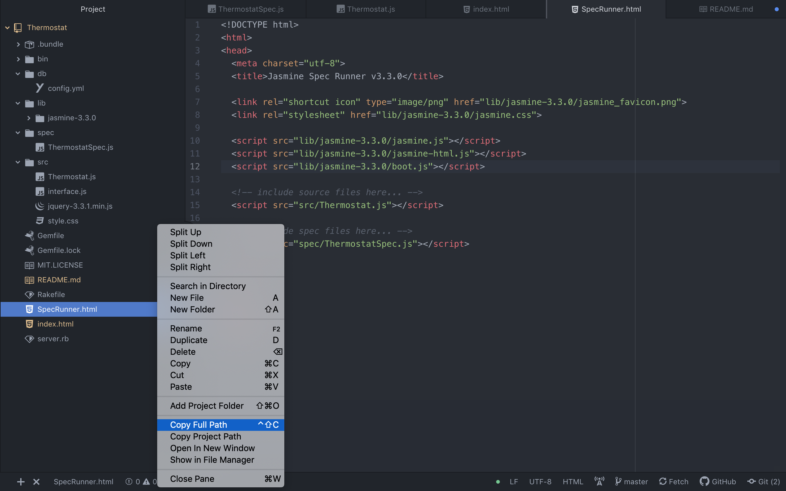
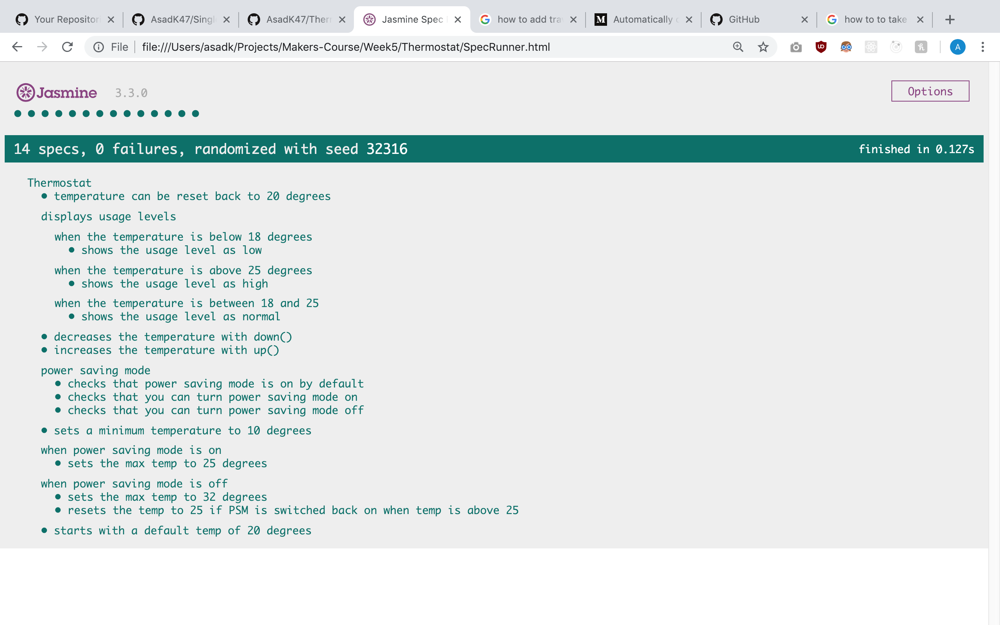

# Thermostat

This is a simple thermostat application made in javascript which has the following functionality:

1. It is able to increase and decrease the temperature on the page, asynchronously, that is to say it can be done without refreshing the page.
2. The power saving mode, which is turned on by default, can be turned off to increase the temperature to above 25 degrees celsius, up to a maximum of 32 degrees celsius.
3. If the power saving mode is turned back on after you increase it greater than 25 degrees, then the temperature will automatically switch back to 25 degrees.
4. You are able to use the search functionality to search for the temperature in a specific city, for example by typing in London, you will be able to see the temperature for London at that time. Many other cities are available apart from this due to the weather api it is using.

## Running Tests

To the run the tests for this application, you will have to simply the run the SpecRunner file in your browser. The SpecRunner is html file which is run after copying the path and pasting the URL into the browser an example of how to do this is shown below.

## Running the application
